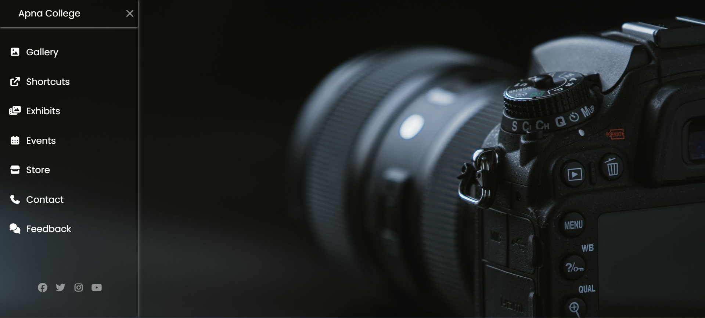

# Responsive Photography Portfolio UI

A modern photography portfolio layout built using HTML5 and CSS3.  
This project demonstrates sidebar navigation design and clean UI structuring.

---

## 🚀 Features

- Sidebar navigation layout
- Clean and modern UI design
- Structured HTML5 layout
- Styled completely using CSS3
- Beginner-friendly and organized code structure

---

## 🛠️ Tech Stack

- HTML5
- CSS3

---

## 📂 Project Structure

---

## 🎯 Purpose of This Project

This project was created to strengthen my understanding of:

- Layout structuring using HTML5
- Sidebar navigation design
- CSS styling techniques
- Frontend project organization

---

## 📸 Preview

---

## 💡 Future Improvements

- Improve mobile responsiveness
- Add smooth animations and transitions
- Expand into a complete portfolio website
- Integrate JavaScript for interactivity

---

## 👨‍💻 Author

Praveen Singh

---

⭐ If you found this project helpful, feel free to fork it or give it a star!
